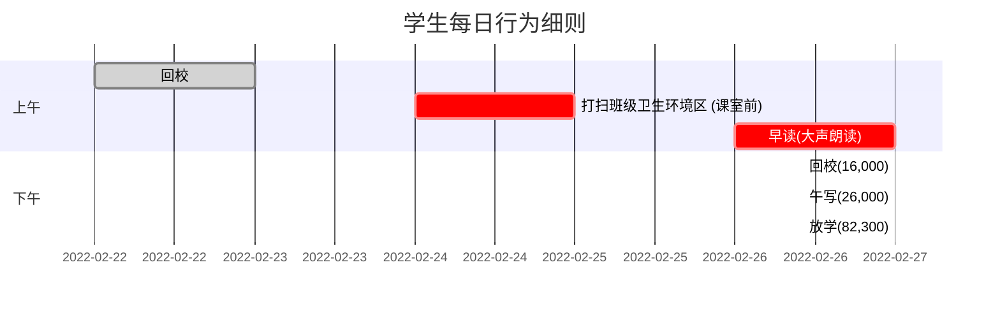
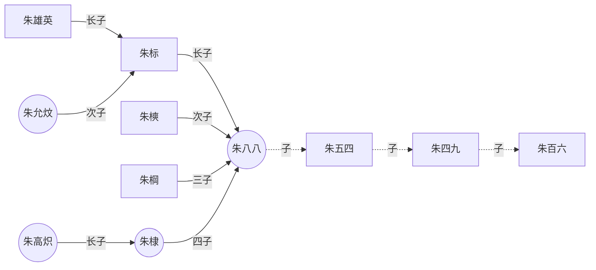
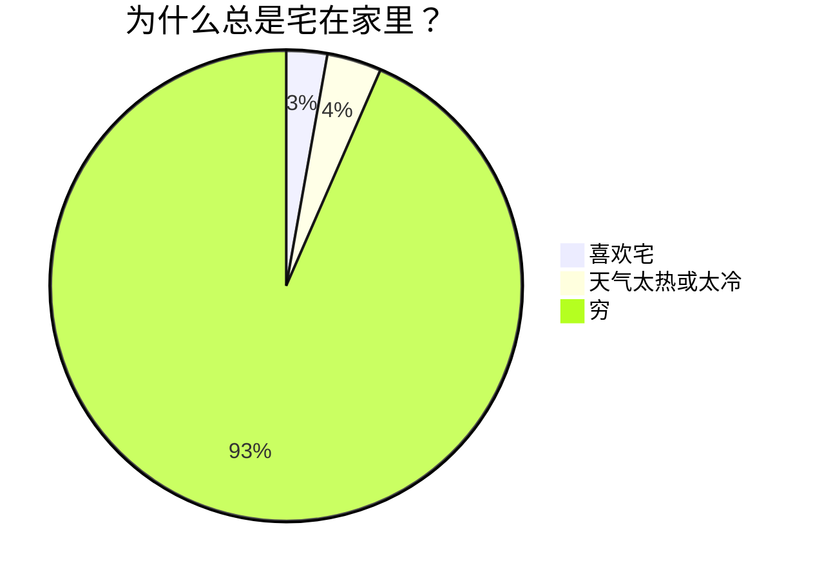
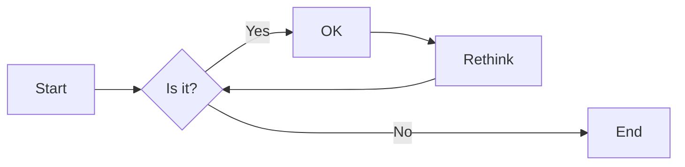
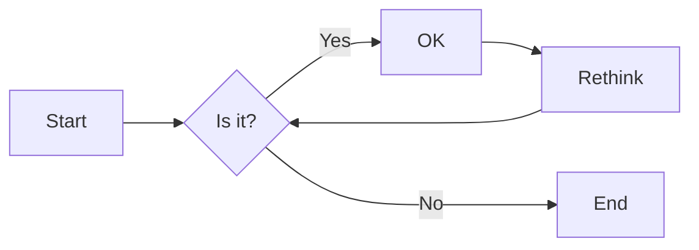

$$
f(x,y,z) = 3y^2z \left( 3+\frac{7x+5}{1+y^2} \right)
$$



```mermaid
gantt
dateformat YYYY-MM-DD
Title 学生每日行为细则
section 上午
回校: done,des1,2022-02-22,2022-02-23
打扫班级卫生环境区 (课室前): crit, des2,2022-02-24,2022-02-25
早读(大声朗读): crit, des3,2022-02-26,2022-02-27
section 下午
回校(16,000): done, 13:00
午写(26,000): done, 15:00
放学(82,300): crit, 18:00


```


```mermaid
graph
    默认方形
    id1[方形]
    id2(圆边矩形)
    id3([体育场形])
    id4[[子程序形]]
    id5[(圆柱形)]
    id6((圆形))
```

````mermaid
graph
	id1{菱形}
	id2{{六角形}}
	id3[/平行四边形/]
	id4[\反向平行四边形\]
	id5[/梯形\]
	id6[\反向梯形/]
````


```mermaid
graph LR
emperor((朱八八))-.子.->朱五四-.子.->朱四九-.子.->朱百六
朱雄英--长子-->朱标--长子-->emperor
emperor2((朱允炆))--次子-->朱标
朱樉--次子-->emperor
朱棡--三子-->emperor
emperor3((朱棣))--四子-->emperor
emperor4((朱高炽))--长子-->emperor3
```



```mermaid
pie
    title 为什么总是宅在家里？
    "喜欢宅" : 15
    "天气太热或太冷" : 20
    "穷" : 500
```



```mermaid
graph LR
    A[Start] --> B{Is it?};
    B -- Yes --> C[OK];
    C --> D[Rethink];
    D --> B;
    B -- No ----> E[End];
```


```mermaid
graph LR
    A[Start] --> B{Is it?};
    B -->|Yes| C[OK];
    C --> D[Rethink];
    D --> B;
    B --->|No| E[End];
```


```mermaid
gantt 
dateFormat HH:mm
axisFormat %H:%M
Initial milestone : milestone, m1, 17:49,2min
taska2 : 10min
taska3 : 5min 
Final milestone : milestone, m2, 18:14, 2min
```

